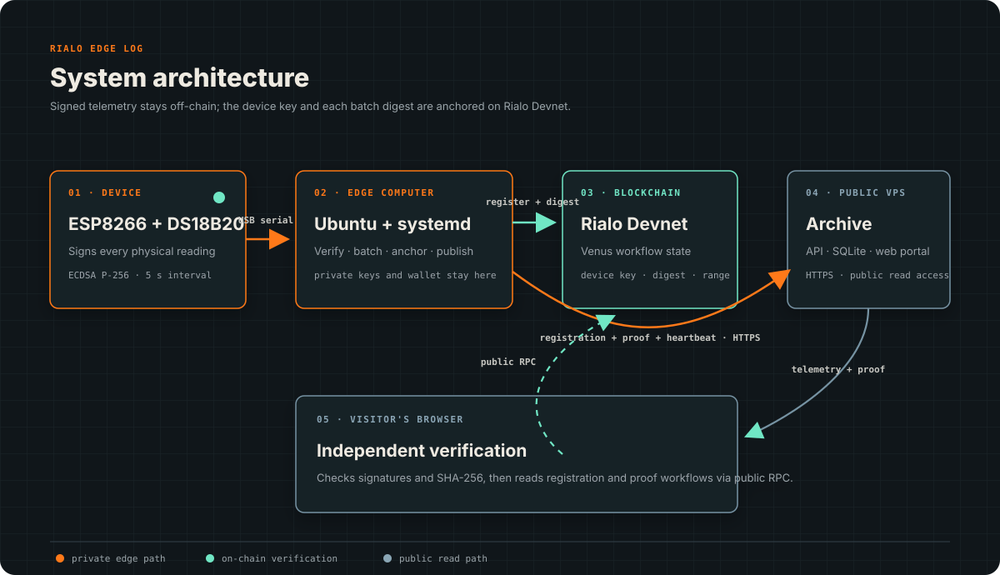

# Rialo Edge Log

Rialo Edge Log is a small IoT experiment that makes later changes to telemetry
detectable. An ESP8266 signs each reading, a gateway groups the readings into
batches, and the batch digest is recorded on Rialo Devnet. The readings stay
off-chain and can be published to a public archive for browser-based checks.

The current firmware targets a physical DS18B20 connected to `D4/GPIO2` on an
ESP8266 NodeMCU. Replacing the original simulator changes only the measurement
source; signing, batching, anchoring, and independent verification retain the
same proof model.

## Deployment transition — September 2026

The original Windows-based prototype produced simulated signed telemetry until
the edge host was taken offline on **September 9, 2026**. The public records
already published by that deployment remain prototype history. No telemetry
continuity is claimed for the offline period.

The second deployment is being prepared on Ubuntu with a new Type-C NodeMCU,
a physical DS18B20, a newly generated device key, and a new on-chain device
registration. The historical device identity is not reused or silently
re-keyed. The VPS archive remains separate from the edge host.

Migration is complete only after signing, batching, Rialo anchoring,
publication, heartbeats, browser verification, and automatic restart have been
validated end-to-end on the new host.

## How it works

```text
ESP8266 + DS18B20 -> Ubuntu gateway -> signed batch -> Rialo Devnet
                                             |
                                             +-> public archive -> browser verification
```

1. The ESP8266 signs every JSON reading with its own ECDSA P-256 key.
2. The local gateway verifies the signature and builds a deterministic batch.
3. The project registrar records the device ID and public-key fingerprint once
   in a dedicated Rialo workflow.
4. A SHA-256 digest of each batch is stored in a separate Rialo Venus workflow.
5. The confirmed batch, registration receipt and public proof are sent to the
   archive.
6. A visitor can recalculate the digest, verify the device signatures and
   independently read both workflow records from Rialo in the browser.

Private keys, wallet files, and ingestion credentials never leave the edge
computer. Raw telemetry is stored off-chain.



The editable Mermaid source is available in
[`docs/architecture.mmd`](docs/architecture.mmd).

## Hardware deployments


This NodeMCU V3 produced the first signed simulator records. It is retained here
as the documented prototype rather than presented as the current physical
sensor. The Ubuntu deployment uses a different ESP8266 NodeMCU with a USB-C
connector and a DS18B20 wired to `D4/GPIO2`.

## Current project state

- historical simulator batches from the retired Windows prototype
- physical DS18B20 firmware with per-reading signatures, ready for flashing
- native Linux gateway, anchor, publisher, balance guard, and optional RPC
  tunnel managed by `systemd`
- receipts linking each batch to its transaction and workflow account
- HTTPS archive at [rialo-edge-log.xyz](https://rialo-edge-log.xyz)
- independent browser checks and links to the matching RialoScan records
- Docker deployment for the archive on the public VPS
- optional self-healing SSH RPC tunnel for networks that block Rialo Devnet
  port `4100`
- schema-3 firmware and verifier support for signed boot-session, reset-reason,
  and enclosure-tamper telemetry fields; existing schema-2 history remains valid
- one-minute signed heartbeats for live device presence on the public portal
- one-time on-chain registration of the device ID and public-key fingerprint

The current Venus program ID is
[`GVJpRi8SVURsjKbLC84Azk24vV2cK3ib74aXRk5hdatF`](https://devnet.rialoscan.org/address/GVJpRi8SVURsjKbLC84Azk24vV2cK3ib74aXRk5hdatF).
The published registrar wallet is
`BBjJpGwN3aV3BrMPw6BCZHZue8btcqTTfXouG9Nv9Sz6`.

Current confirmed transactions, workflows and independent verification results
are shown in the [live archive](https://rialo-edge-log.xyz). Fixed transaction
examples are intentionally not kept here because Rialo Devnet can reset.

## Repository map

- [`firmware/nodemcu_signed`](firmware/nodemcu_signed) — signed ESP8266 firmware
- [`firmware/nodemcu_simulator`](firmware/nodemcu_simulator) — unsigned starter sketch
- [`gateway`](gateway) — serial collection, batching, anchoring, and publishing
- [`rialo/edge-log-proof`](rialo/edge-log-proof) — Venus workflow
- [`archive`](archive) — public archive and API
- [`portal`](portal) — RU/EN browser interface and verifier
- [`deploy`](deploy) — VPS, Windows prototype, and Ubuntu edge setup

Each directory has its own setup notes. For the current physical-sensor host,
start with [`deploy/linux-edge/README.md`](deploy/linux-edge/README.md).

## What the proof does and does not prove

The proof shows that a published batch matches the readings signed by the
on-chain registered device key and the digest recorded on Rialo. The browser
also checks that the registration transaction was signed by the project's
published registrar wallet. If an archived value is edited later, verification
fails.

It does not prove that the sensor was calibrated, installed correctly, or
measured the physical world accurately. Device compromise before signing is
also outside this prototype's trust boundary.

Schema-3 readings bind the device boot session, ESP8266 reset reason, and
tamper-switch state to the same device signature as the temperature. Heartbeat
delivery is operational metadata: the archive accepts it only after verifying
the latest reading and matching its key to a previously published device.

## Next steps

- flash the new Type-C NodeMCU with its own locally generated device key
- validate the DS18B20 on `D4/GPIO2` before starting any on-chain submission
- activate the Ubuntu services in stages without modifying the co-located
  Orbinum validator
- register the new device identity on-chain and verify the first public proof
- make workflow identifiers easier to trace across long-running deployments
- add an end-to-end test covering collection, anchoring, publication, and
  browser verification
- replace the temporary VPS RPC route when Rialo exposes a universally
  reachable HTTPS endpoint
- review a lower anchoring frequency for longer runs

## Security and project status

This repository is for development and Devnet use. Do not commit Wi-Fi
passwords, private keys, wallet files, ingestion tokens, or generated telemetry.
Rialo Devnet can reset without notice. Receipts from an earlier network state
remain useful as local history but cannot prove current on-chain availability.

This is an independent open-source experiment on Rialo Devnet. It is not
affiliated with or endorsed by Rialo Labs or Subzero Labs and is not official
Rialo software.
